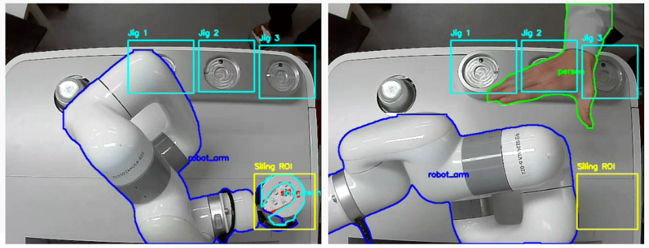
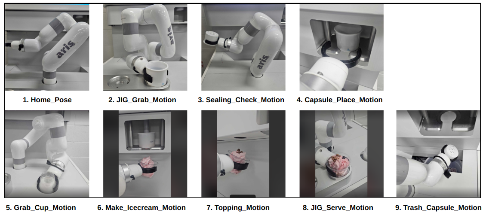
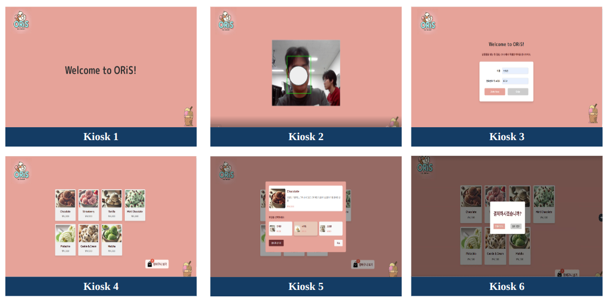
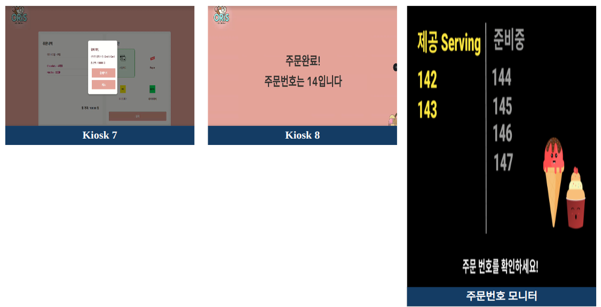
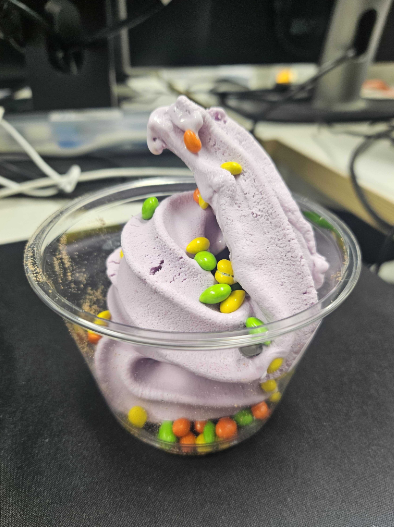

프로젝트명: DIR:Interactive Ice-cream Robot

팀명: Oris

### Double I Robot (DIR)

- 의미 있는 기능을 담아내는 Directory처럼 아이스크림 로봇에 의미 있는 기능을 담아내고 싶은 마음

- 그대로 읽으면, 친애하는/소중한 이라는 의미가 있는 Dear - 소중한 고객을 위해

### ORiS
**O**(5조 = **O**jo)

**Ri**(a**Ri**s)

**S**(**S**torage)

## Sysyem Architecture

- Frontend, Backent, Database 모두 유연성있게 연동되어서 사용자에게 편의성을 제공

- 얼굴 특징 벡터를 저장하는 벡터 DB, Milvus 활용

## Tech

### Segmentation

- Segmentation 검출: 로봇팔, 사람손, 아이스크림 통, 씰
- ROI 구역 설정: 아이스크림 유무 판단할 구역, 씰 검출할 구역
- 사람 손과 로봇팔이 닿을 즘, 멈추라는 TTS 신호

### Robot control

- 로봇 동작을 모듈화 해서 동작의 유연성 확보

## Result (UI & Ice-cream)
### UI

### Ice-cream

- 

## Demo (Click - Video)

